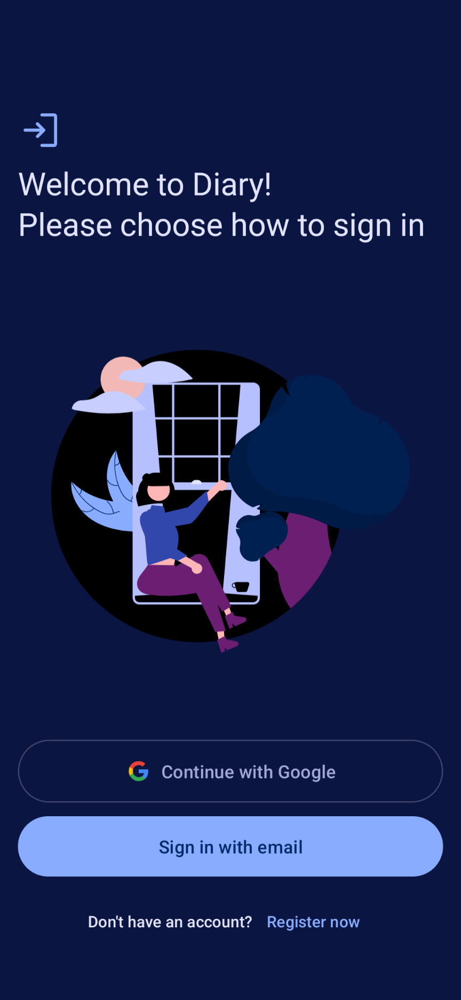
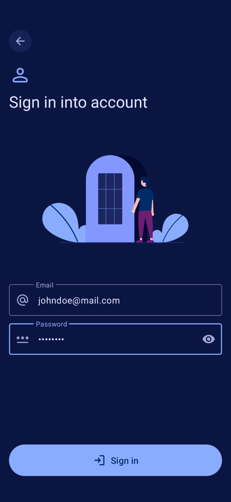
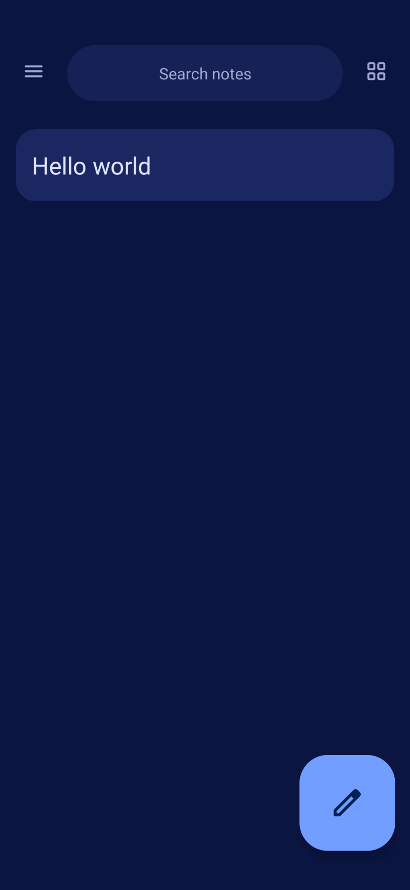
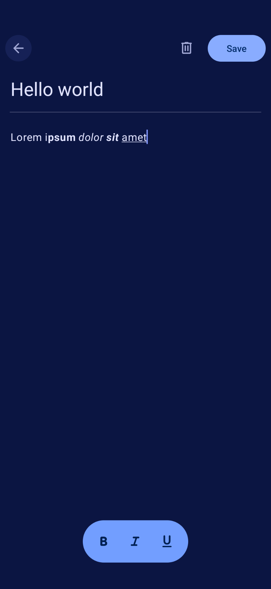
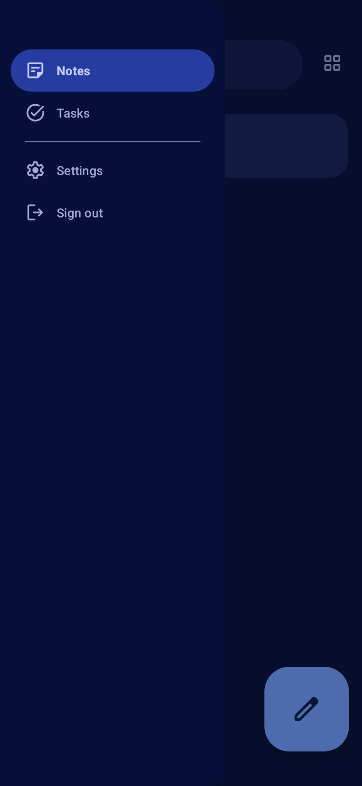
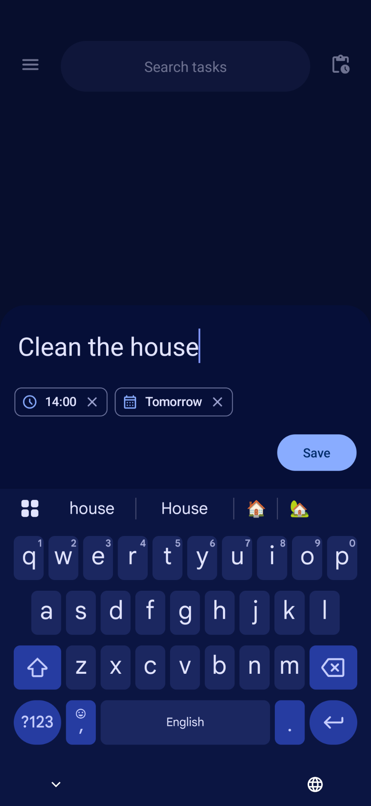
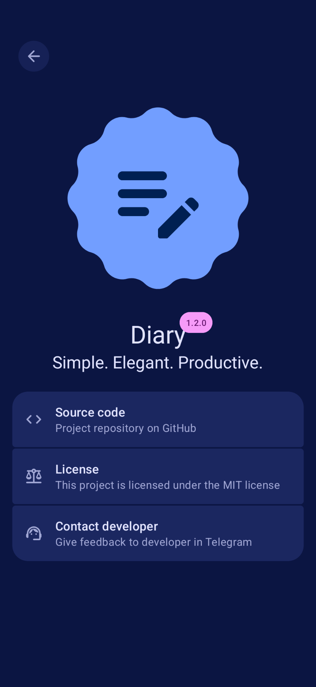

# 📖 Diary

[🇬🇧EN](https://github.com/HotarunIchijou/Diary?tab=readme-ov-file)/🇷🇺RU

**Diary** — это простое и элегантное мобильное приложение, созданное на **Kotlin** с использованием дизайна **Material 3 Expressive**. Оно оснащено **редактором с расширенным форматированием текста**, позволяющим пользователю использовать жирный, курсивный и подчёркнутый стили — идеально подходит для ведения дневника или записи мыслей и идей. Это приложение разрабатывается в рамках **учебного проекта**.  

## ✨ Основные возможности  
- **Редактор с форматированием текста**:  
  Добавляйте жирный, курсивный и подчёркнутый текст в свои записи  

- **Дизайн Material 3 Expressive**:  
  Современный и минималистичный интерфейс с поддержкой светлой и тёмной тем  

- **Интеграция с Firebase**:  
  Firebase Realtime Database для безопасного хранения и управления записями в облаке  

## 🎨 Скриншоты  
|  |  | 
|---                                                     |---                                                     |---   
|  |  |              
|  |  | 


## 📲 Установка  
Чтобы установить приложение:  
1. Клонируйте этот репозиторий:

    ```bash
    git clone https://github.com/HotarunIchijou/Diary.git
    ```

2. Откройте проект в **Android Studio**  
3. Синхронизируйте Gradle и установите зависимости  
4. Запустите проект на эмуляторе или физическом устройстве  

## 🛠️ Стек технологий  
- **Язык программирования**: Kotlin  
- **Фреймворк дизайна**: Material 3 Expressive
- **База данных**: Firebase Realtime Database, Room Database (SQLite)

## 🚀 Использование  
1. Откройте приложение и зарегистрируйтесь или войдите в существующий аккаунт  
2. Создайте новую запись в дневнике  
3. Используйте редактор с форматированием для стилизации текста  
4. Сохраните запись  

## 📝 Список дел  
Вот что планируется в будущих обновлениях:  
- [x] Добавить функцию **авто-сохранения**  
- [x] Переписать некоторые активности на фрагменты  
- [x] Реализовать задачи наряду с заметками  
- [x] Добавить настройки  
- [x] Добавить темы  

## 🤝 Вклад  
Участие приветствуется!  
1. Сделайте fork репозитория  
2. Создайте новую ветку с вашей функцией или исправлением  
3. Сделайте commit и push ваших изменений  
4. Создайте pull request для ревью  

## ⚖️ Лицензия  
Этот проект распространяется под лицензией [MIT License](https://github.com/HotarunIchijou/Diary/blob/master/LICENSE)

## 📧 Контакт  
Если есть вопросы или предложения — пишите:  
- **Email**: hotarunichijou@ik.me  
- **Telegram**: [@KaorunIchijou](https://t.me/KaorunIchijou)

## 🙌 Особая благодарность:  
- [Shemmy](https://github.com/N3Shemmy3) и [Nick](https://github.com/nift4) за неоценимую поддержку на протяжении всей разработки  
- [Nathan](https://github.com/imnathanzero) за тестирование приложения  
- 1gravity за создание нативной [библиотеки форматирования текста](https://github.com/1gravity/Android-RTEditor)
